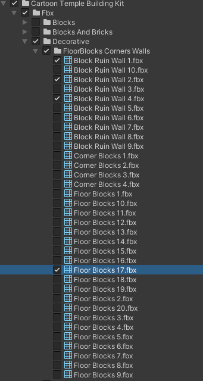
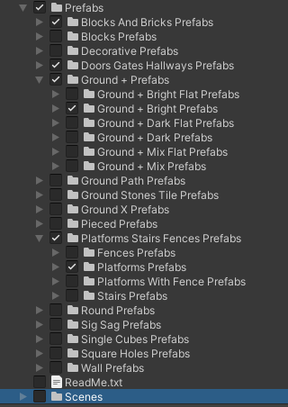

Mango2_5D.exe
===============
Mango2_5D is a PC, 2.5D Side-scroller Close Combat-Platformer game written in C# using Unity.

Unity Version
-------------
unity 2021.3.5f1

Packages to Install
-------------
- Unity packages: https://assetstore.unity.com/packages
    - Cinemachine Version 2.8.9
    - ProBuilder Version 5.0.6
    - Input System Version 1.3.0
    - Kevin Iglesias's Basic Motions 1.2
    - Cartoon Temple Building Kit Lite A3D
    - Check that you do have Universal RP Version 12.1.7

     - Basic Motions
     --------------
     
     Kevin Iglesias's Basic Motions 1.2 : https://assetstore.unity.com/packages/3d/animations/basic-motions-free-154271
     - Need to import : 
        - AnimationControllers: Fall, Idle, Jump, Run, Walk
        - Animations: Idles: Idle01; Movement : Fall, Jump, Run, Walk
        - Materials: Material, Floor (optional)
        - Models, Prefabs,Textures : (unique asset in folder)

      - Cartoon Temple
      -----------------

      Cartoon Temple Building Kit Lite A3D : https://assetstore.unity.com/packages/3d/environments/dungeons/cartoon-temple-building-kit-lite-110397#content
     - Need to import : 
      - Fbx/Blocks
      - Fbx/Blocks And Bricks
      - Fbx/Doors Gates Hallways
      - Fbx/Ground + Bright
      - Fbx/Platforms Stairs Fences
	- Fbx/Decorative/Misc
	- Fbx/Walls

      - Materials/Cartoon Templ Builder Kit.mat
      - Materials/Textures/Cartoon Temple Builder Kit.png
      
      
      
      - Fbx/Decorative/FloorBlocks Corners Walls/Block Ruin Wall 1,2&4
      - Fbx/Decorative/FloorBlocks Corners Walls/Floor Blocks 17
      
      

      - Prefabs/Blocks
      - Prefabs/Blocks And Bricks
      - Prefabs/Doors Gates Hallways
      - Prefabs/Ground +/Ground + Bright
      - Prefabs/Platforms Stairs Fences
	- Prefabs/Decorative/Misc
	- Prefabs/Pieced
	- Prefabs/Wall

      
      
      - Prefabs/Decorative/FloorBlocks Corners Walls/Block Ruin Wall 1,2&4
      - Prefabs/Decorative/FloorBlocks Corners Walls/Floor Blocks 17
      

    - Don't forget to update to URP (Universal Render Pipeline): Select the newly added Materials then Edit->Rendering->Materials->Convert Selected Built-in Materials to URP

Controls
--------
Keyboard (Easier to test):
    - W   Look up
    - A   Move Left  /look left
    - S   Move Right /look right
    - D   Look down ?
    - left click to attack # Not Available yet
    - right click to throw lance
    - Shift to dash
    - Space to jump

Gamepad:
LeftStick:
    - Look at direction()
    - Left  Move Left
    - Right Move Right
    - Right Trigger to throw lance
    - Left  Trigger to dash
    - West  (X) to attack # Not Available yet
    - North (Y) to attack # Not Available yet
    - South (A) to jump
    - East  (B) to jump

